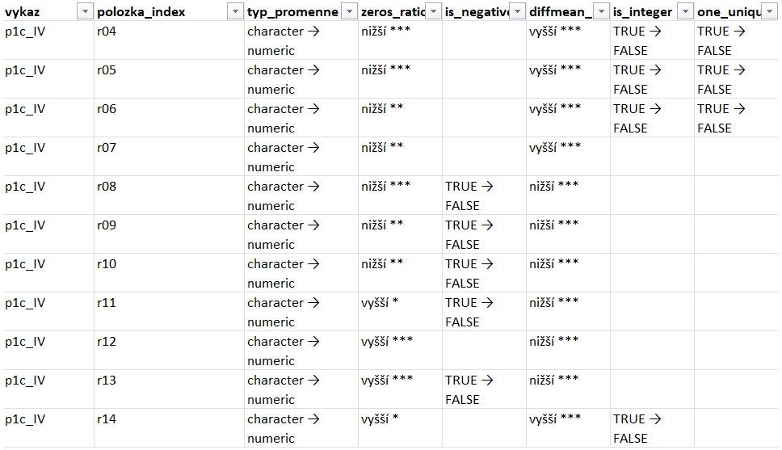

```{css, echo=FALSE}
figcaption,
.figure-caption,
.quarto-float-caption-inner {
  text-align: center !important;
  color: #6c757d;
  font-size: 0.95em;
  text-align: left;
}

figure.quarto-float-tbl figcaption.quarto-float-caption-top {
  text-align: left !important;
  color: #6c757d;
  font-size: 0.95em;
}

table caption {
  text-align: left !important;
  color: #6c757d;
  font-size: 0.95em;
}

table th {
  text-align: center !important;
  vertical-align: middle !important;
}
```

Tato metodika popisuje postup automatizované validace r-kových proměnných z výkazů personalistiky a mezd (PaM) zpracovávaných ve formátu `.parquet`. Cílem je systematická kontrola kvality dat – detekce strukturálních nesrovnalostí, chybějících hodnot, záporných hodnot, odlehlých pozorování a nekonzistentního měření v čase. Oproti validaci datového modelu školy pracuje PaM validace s měsíční časovou dimenzí a automaticky detekuje frekvenci měření jednotlivých proměnných.

Výstupem jsou strukturované přehledy ve formátu `.xlsx`, jeden soubor za každý výkaz (P1-04, P1a, případně oddíly P1c).

------------------------------------------------------------------------

# Vstupní data

Validace pracuje se třemi typy výkazů, každý s odlišnou strukturou:

+--------------+----------------------------+------------------------+-------------------------------------+
| Výkaz        | Vzor r-proměnných          | Identifikátor zařízení | Vstupní soubor(y)                   |
+==============+============================+========================+=====================================+
| **P1-04**    | `r102`–`r391`              | `red_izo`              | jeden `.parquet`                    |
+--------------+----------------------------+------------------------+-------------------------------------+
| **P1a**      | `r010102`–`r051305`,\      | `rid`                  | jeden `.parquet`                    |
|              | `r5s0802`–`r5s1305`        |                        |                                     |
+--------------+----------------------------+------------------------+-------------------------------------+
| **P1c**      | `r01`–`r14`, `r601`–`r612` | `red_izo`              | více `.parquet` souborů dle oddílů\ |
|              |                            |                        | (IV, IVa, IVb, …, VIII)             |
+--------------+----------------------------+------------------------+-------------------------------------+

Všechny výkazy sdílejí společný vektor ID sloupců `c("rok", "mes", "hosp_druh", "plat_rad", "druh_pam", "druh")`. Při načtení dat se pro každý výkaz vybírají pouze sloupce přítomné v daném parquetu (`intersect`):

-   **P1-04**: `rok`, `mes`, `hosp_druh`, `plat_rad`, `druh_pam`
-   **P1a**: `rok`, `mes`, `hosp_druh`, `plat_rad` (bez `druh_pam`)
-   **P1c**: `rok`, `druh`

Labely (popisné štítky) proměnných se načítají ze souboru `pamvykpol_labels.xlsx`.

## Specifika jednotlivých výkazů

### P1-04

Výkaz se středně velkým počtem proměnných s převážně čtvrtletní frekvencí. Výkaz s nejbohatší strukturou – až stovky proměnných s čtvrtletní měření. Kód proměnné v datech (např. `r136`) se před spárováním s labely transformuje do formátu `pamvykpol_labels.xlsx` (např. `r01036.p1`). Frekvence měření se detekuje automaticky – všechny proměnné jsou čtvrtletní, statistiky se počítají z mezikvartálních diferencí.

### P1a

Výkaz s nejbohatší strukturou – až stovky proměnných s čtvrtletní měření. Chybí sloupec `druh_pam`. Identifikátor zařízení je `rid`, případně `ico` (nikoliv `red_izo` jako u ostatních výkazů). U ročních proměnných se statistiky počítají také z mezikvartálních diferencí.

### P1c

Výkaz je rozdělen do oddílů (IV, IVa, ..., VIII), každý oddíl je samostatný `.parquet` soubor. Validace se spouští ve smyčce přes všechny oddíly, každý oddíl dostane vlastní `.xlsx` report. Kód proměnné v datech (např. `r01` v VIII. oddíle) se před párováním s labely přepočítá pomocí funkce `oddil_to_code()`, která převede římskou číslici oddílu na dvouciferný kód (např. VIII → `08`, IVa → `4a`), výsledný klíč má formát `r08001.1c`. ID sloupce P1c jsou `rok`, `mes`, `druh` – odvozeny ze sdíleného vektoru `id_cols` přes `intersect`.

------------------------------------------------------------------------

# Spuštění validace

Před spuštěním je třeba nastavit datum testované várky dat ve skriptu `validace_PAM.R`:

``` r
datum_test <- '260421'   # YYMMDD – datum parquet souboru k otestování
```

Spuštění celé validace:

``` r
source("validace_PAM.R")
```

Výsledné reporty se ukládají do složky `Výkazy-validace/<datum_test>/`.

------------------------------------------------------------------------

# Výstupní `.xlsx` reporty

Každý výkaz (P1-04, P1a, oddíly P1c) generuje samostatný `.xlsx` soubor se čtyřmi listy.

## List „Report overview"

Shrnuje základní informace o struktuře a kvalitě dat. List je tvořen sekcemi se záhlavím, skládajícími se pod sebou:

+---------------------------------+-----------------------------------------------------------------------------------------------------------------------------------------------------------------------------------------------------------------------------------+--------+
| Sekce                           | Obsah                                                                                                                                                                                                                             |        |
+=================================+===================================================================================================================================================================================================================================+========+
| **Název výkazu**                | Označení výkazu (P1-04, P1a, P1c s oddílem).                                                                                                                                                                                      |        |
+---------------------------------+-----------------------------------------------------------------------------------------------------------------------------------------------------------------------------------------------------------------------------------+--------+
| **Filtrováno na roky ≤ X**      | Zobrazí se, pokud byl nastaven parametr `max_rok`. Ukazuje, do kterého roku data vstupují do analýzy                                                                                                                              |        |
+---------------------------------+-----------------------------------------------------------------------------------------------------------------------------------------------------------------------------------------------------------------------------------+--------+
| **Typy proměnných**             | Přehled počtu r-proměnných dle datového typu (`numeric`, `character`, …).                                                                                                                                                         |        |
+---------------------------------+-----------------------------------------------------------------------------------------------------------------------------------------------------------------------------------------------------------------------------------+--------+
| **Frekvence měření**            | Počet proměnných dle detekované frekvence měření: roční / pololetní / čtvrtletní / měsíční / nepravidelná / neměřeno.                                                                                                             |        |
+---------------------------------+-----------------------------------------------------------------------------------------------------------------------------------------------------------------------------------------------------------------------------------+--------+
| **Metriky**                     | Tabulka klíčových ukazatelů:                                                                                                                                                                                                      |        |
|                                 |                                                                                                                                                                                                                                   |        |
|                                 | -   *Identifikátor zařízení* – sloupec použitý jako identifikátor (`red_izo`, `rid`, …).                                                                                                                                          |        |
|                                 | -   *Počet let* – počet unikátních let v datech.                                                                                                                                                                                  |        |
|                                 | -   *Počet řádků* – celkový počet řádků v datasetu.                                                                                                                                                                               |        |
|                                 | -   *Výskyt závažných chyb* – počet proměnných se závažnými chybami ze všech proměnných, a celkový počet \| chyb. Formát: `5 / 16 (3 chyby)` = 5 proměnných z 16 má 3 závažné chyby. Zobrazí se jen pokud \> 0.                   |        |
|                                 | -   *Výskyt zvláštního chování* – počet proměnných se zvláštním chováním ze všech proměnných, a celkový počet výskytů. Formát: `4 / 16 (2 chyby)` = 4 proměnné z 16 mají 2 výskyty zvláštního chování. Zobrazí se jen pokud \> 0. |        |
|                                 | -   *Počet záporných proměnných* – proměnné s alespoň jednou zápornou hodnotou.                                                                                                                                                   |        |
|                                 | -   *Počet nevyplněných identifikátorů* – řádky, kde je identifikátor zařízení prázdný.                                                                                                                                           |        |
|                                 | -   *Počet prázdných labelů* – proměnné bez namapovaného popisného štítku v `pamvykpol_labels.xlsx`.                                                                                                                              |        |
|                                 | -   *Existence nekonzistentního měření* – zda alespoň jedna proměnná má nekonzistentní pokrytí.                                                                                                                                   |        |
|                                 | -   *Existence duplicit* / *Počet duplicit* – zda se ve výkaze vyskytují opakované kombinace klíčových sloupců a v jakém počtu.                                                                                                   |        |
+---------------------------------+-----------------------------------------------------------------------------------------------------------------------------------------------------------------------------------------------------------------------------------+--------+
| **Příklady duplicit**           | Konkrétní příklady duplicitních řádků (pokud existují).                                                                                                                                                                           |        |
+---------------------------------+-----------------------------------------------------------------------------------------------------------------------------------------------------------------------------------------------------------------------------------+--------+
| **Zařízení s nejvíce outlierů** | Top 20 zařízení s alespoň 5 outliery, seřazená sestupně.                                                                                                                                                                          |        |
+---------------------------------+-----------------------------------------------------------------------------------------------------------------------------------------------------------------------------------------------------------------------------------+--------+

## List „Summary"

Každý řádek odpovídá jedné r-proměnné. Sloupce a jejich význam:

+------------------------------+----------------------------------------------------------------------------------------------------------------------------------------------------------------------------------------------------------------------------------------------------------------------------------------------------------------------------------+
| Sloupec                      | Význam                                                                                                                                                                                                                                                                                                                           |
+==============================+==================================================================================================================================================================================================================================================================================================================================+
| `polozka_index`              | Kód proměnné v datech (např. `r001`, `r01001`, `r1`, `r01`).                                                                                                                                                                                                                                                                     |
+------------------------------+----------------------------------------------------------------------------------------------------------------------------------------------------------------------------------------------------------------------------------------------------------------------------------------------------------------------------------+
| `typ_promenne`               | Datový typ (`numeric`, `character`, …).                                                                                                                                                                                                                                                                                          |
+------------------------------+----------------------------------------------------------------------------------------------------------------------------------------------------------------------------------------------------------------------------------------------------------------------------------------------------------------------------------+
| `count_years`                | Počet let, ve kterých se u proměnné vyskytuje alespoň jedna nenulová hodnota.                                                                                                                                                                                                                                                    |
+------------------------------+----------------------------------------------------------------------------------------------------------------------------------------------------------------------------------------------------------------------------------------------------------------------------------------------------------------------------------+
| `count_mes`                  | Celkový počet měsíců s nenulovou hodnotou napříč všemi lety.                                                                                                                                                                                                                                                                     |
+------------------------------+----------------------------------------------------------------------------------------------------------------------------------------------------------------------------------------------------------------------------------------------------------------------------------------------------------------------------------+
| `modus_mesicu_za_rok`        | Nejčastější počet měřených měsíců za rok (modus). Pokud není modus jednoznačný (více hodnot se vyskytuje se stejnou nejvyšší četností), použije se medián. Základ pro detekci frekvence měření.                                                                                                                                  |
+------------------------------+----------------------------------------------------------------------------------------------------------------------------------------------------------------------------------------------------------------------------------------------------------------------------------------------------------------------------------+
| `frekvence_mereni`           | Detekovaná frekvence měření: `roční` / `pololetní` / `čtvrtletní` / `měsíční` / `nepravidelná`.                                                                                                                                                                                                                                  |
+------------------------------+----------------------------------------------------------------------------------------------------------------------------------------------------------------------------------------------------------------------------------------------------------------------------------------------------------------------------------+
| `na_ratio`                   | Podíl `NA` hodnot v měřených letech (formátováno jako %).                                                                                                                                                                                                                                                                        |
+------------------------------+----------------------------------------------------------------------------------------------------------------------------------------------------------------------------------------------------------------------------------------------------------------------------------------------------------------------------------+
| `zeros_ratio`                | Podíl nulových hodnot v měřených letech (formátováno jako %).                                                                                                                                                                                                                                                                    |
+------------------------------+----------------------------------------------------------------------------------------------------------------------------------------------------------------------------------------------------------------------------------------------------------------------------------------------------------------------------------+
| `count_uniques`              | Počet unikátních hodnot. U ročních z raw hodnot, u subročních proměnných počítán z hodnot diferencí mezi po sobě jdoucími měřeními (zachycuje změny v čase), u ročních z raw hodnot – pak v názvu metriky suffix `_diff`.                                                                                                        |
+------------------------------+----------------------------------------------------------------------------------------------------------------------------------------------------------------------------------------------------------------------------------------------------------------------------------------------------------------------------------+
| `min` / `max`                | Minimum a maximum. U ročních z raw hodnot, u subročních proměnných počítán z hodnot diferencí mezi po sobě jdoucími měřeními (zachycuje změny v čase), u ročních z raw hodnot – pak v názvu metriky suffix `_diff`.                                                                                                              |
+------------------------------+----------------------------------------------------------------------------------------------------------------------------------------------------------------------------------------------------------------------------------------------------------------------------------------------------------------------------------+
| `is_negative`                | Logická proměnná: `TRUE` pokud se vyskytují záporné hodnoty.                                                                                                                                                                                                                                                                     |
+------------------------------+----------------------------------------------------------------------------------------------------------------------------------------------------------------------------------------------------------------------------------------------------------------------------------------------------------------------------------+
| `outliers_ratio`             | Podíl odlehlých hodnot (formátováno jako %). Za odlehlé jsou považovány hodnoty překračující práh $> Q_3 + 3 \times IQR$. U sub-ročních proměnných se sleduje i dolní mez $< Q_1 - 3 \times IQR$. Horní mez se počítá z nenulových a neprázdných hodnot, dolní mez ze všech neprázdných hodnot (nula v diferenci = žádná změna). |
+------------------------------+----------------------------------------------------------------------------------------------------------------------------------------------------------------------------------------------------------------------------------------------------------------------------------------------------------------------------------+
| `label_result`               | Popisný štítek proměnné namapovaný z `pamvykpol_labels.xlsx`.                                                                                                                                                                                                                                                                    |
+------------------------------+----------------------------------------------------------------------------------------------------------------------------------------------------------------------------------------------------------------------------------------------------------------------------------------------------------------------------------+
| `first_year` / `last_year`   | První a poslední rok, ve kterém má proměnná neprázdná data.                                                                                                                                                                                                                                                                      |
+------------------------------+----------------------------------------------------------------------------------------------------------------------------------------------------------------------------------------------------------------------------------------------------------------------------------------------------------------------------------+
| `year<rok>` (např. `year23`) | Logický sloupec pro každý rok: `TRUE` = pokrytí v daném roce odpovídá očekávané frekvenci, `FALSE` = chybí některý očekávaný měsíc, `NA` = proměnná se v daném roce neměřila.                                                                                                                                                    |
+------------------------------+----------------------------------------------------------------------------------------------------------------------------------------------------------------------------------------------------------------------------------------------------------------------------------------------------------------------------------+

> **Skryté sloupce:** `count_notintegers` (počet neceločíselných hodnot), `outlier_limit_upper` (horní hranice odlehlostí: $Q_3 + 3 \times IQR$) a `outlier_limit_lower` (dolní hranice odlehlostí v diferencích: $Q_1 - 3 \times IQR$; pro roční proměnné prázdné) jsou v listu přítomny, ale skryté – slouží pro vnitřní výpočty.

### Detekce frekvence měření {#sec-frekvence}

Frekvence se detekuje automaticky z dat jako modus počtu měřených měsíců za rok (v případě nejednoznačného modu medián):

+-------------------------------+------------------------------+
| Modus měsíců                  | Frekvence                    |
+===============================+==============================+
| 12                            | měsíční                      |
+-------------------------------+------------------------------+
| 6                             | pololetní                    |
+-------------------------------+------------------------------+
| 4                             | čtvrtletní                   |
+-------------------------------+------------------------------+
| 1                             | roční                        |
+-------------------------------+------------------------------+
| ostatní                       | nepravidelná                 |
+-------------------------------+------------------------------+
| `NA`                          | neměřeno                     |
+-------------------------------+------------------------------+

Je připuštěna možnost, aby se roční proměnné v různých výkazech mohly vykazovat v různých měsících (nejenom v září, ale např. i v červnu nebo v prosinci). Validace nezpevňuje prosinec jako jediný přípustný měsíc měření. Místo toho z dat zjistí, ve kterém měsíci daná proměnná nejčastěji vykazuje hodnoty (modus přes všechna léta), a ten pak použije jako referenční při kontrole pokrytí – tj. ověří, zda je tento měsíc přítomen v každém roce.

### Statistiky z diferencí vs. raw hodnot

Pro proměnné s **sub-roční frekvencí** (měsíční, čtvrtletní, pololetní) se `count_uniques`, `min`, `max` a `outliers_ratio` počítají z **diferencí** mezi po sobě jdoucími hodnotami – lépe zachytí skokové změny a anomálie v průběhu roku. Pro **roční** proměnné se počítají z **raw hodnot**.

## List „Strange behaviour"

Každý řádek odpovídá jedné proměnné, seřazeno sestupně dle závažnosti (`count_serious_errors`, pak `count_strange_behaviour`). Sloupce:

+------------------------------+----------------------------------------------------------------------------------------------------------------+-----------------------+
| Sloupec                      | Význam                                                                                                         | Očekávaná hodnota     |
+==============================+================================================================================================================+=======================+
| `polozka_index`              | Kód proměnné.                                                                                                  | –                     |
+------------------------------+----------------------------------------------------------------------------------------------------------------+-----------------------+
| `label_result`               | Popisný štítek, pokud se podařil namapovat z `pamvykpol_labels.xlsx`.                                          | neprázdné             |
+------------------------------+----------------------------------------------------------------------------------------------------------------+-----------------------+
| `frekvence_mereni`           | Detekovaná frekvence měření dle mechanismu popsaném v @sec-frekvence.                                          | jiná než nepravidelná |
+------------------------------+----------------------------------------------------------------------------------------------------------------+-----------------------+
| `mereni_ok_ratio`            | Podíl let s plným pokrytím očekávaných měsíců (v %).                                                           | 0 %                   |
+------------------------------+----------------------------------------------------------------------------------------------------------------+-----------------------+
| `count_serious_errors`       | Počet závažných chyb (viz níže). Proměnné s hodnotou $> 0$ je třeba prošetřit přednostně.                      | 0                     |
+------------------------------+----------------------------------------------------------------------------------------------------------------+-----------------------+
| `count_strange_behaviour`    | Počet měkkých varování (viz níže).                                                                             | 0                     |
+------------------------------+----------------------------------------------------------------------------------------------------------------+-----------------------+
| `not_negative`               | Neobsahuje záporné hodnoty.                                                                                    | `TRUE`                |
+------------------------------+----------------------------------------------------------------------------------------------------------------+-----------------------+
| `is_integer`                 | Všechny hodnoty jsou celá čísla.                                                                               | `TRUE`                |
+------------------------------+----------------------------------------------------------------------------------------------------------------+-----------------------+
| `empty_variable`             | Proměnná je prázdná ve všech letech (100 % `NA`).                                                              | `FALSE`               |
+------------------------------+----------------------------------------------------------------------------------------------------------------+-----------------------+
| `without_na`                 | Žádné `NA` hodnoty v měřených letech.                                                                          | `TRUE`                |
+------------------------------+----------------------------------------------------------------------------------------------------------------+-----------------------+
| `high_na_ratio`              | Podíl `NA` ≥ 95 %.                                                                                             | `FALSE`               |
+------------------------------+----------------------------------------------------------------------------------------------------------------+-----------------------+
| `one_unique_value`           | Proměnná má nejvýše jednu unikátní hodnotu.                                                                    | `FALSE`               |
+------------------------------+----------------------------------------------------------------------------------------------------------------+-----------------------+
| `significant_diffmean_range` | Výrazně vysoké výkyvy ročních průměrů (horních 5 %).                                                           | `FALSE`               |
+------------------------------+----------------------------------------------------------------------------------------------------------------+-----------------------+
| `greater_outliers_ratio`     | Podíl odlehlých hodnot $> 1$ %.                                                                                | `FALSE`               |
+------------------------------+----------------------------------------------------------------------------------------------------------------+-----------------------+
| `existing_label`             | K proměnné existuje popisný štítek.                                                                            | `TRUE`                |
+------------------------------+----------------------------------------------------------------------------------------------------------------+-----------------------+
| `inconsistent_mereni`        | `TRUE` pokud frekvence měření není konzistentní napříč lety (tj. pokrytí $< 100$ % u pravidelných proměnných). | `FALSE`               |
+------------------------------+----------------------------------------------------------------------------------------------------------------+-----------------------+

**Závažné chyby** (`count_serious_errors`) – proměnné, kde je třeba okamžitá pozornost:

-   `empty_variable == TRUE` – proměnná neobsahuje žádná data
-   `existing_label == FALSE` – chybí popisný štítek
-   `inconsistent_mereni == TRUE` – nekonzistentní pokrytí měsíců

**Měkká varování** (`count_strange_behaviour`) – sčítá zbývající flagy: `!not_negative`, `!is_integer`, `!without_na`, `high_na_ratio`, `one_unique_value`, `significant_diffmean_range`, `greater_outliers_ratio`.

## List „Example of strange behaviour"

Agregovaná tabulka s **jedním řádkem na proměnnou** – zobrazeny jsou pouze proměnné s alespoň jedním detekovaným problémem. Každý sloupec obsahuje textové shrnutí:

+-------------------------+-----------------------------------------------------------------------------------------------------------------------------------------------------+
| Sloupec                 | Obsah                                                                                                                                               |
+=========================+=====================================================================================================================================================+
| `NAs_example`           | Počet `NA` hodnot v jednotlivých měřených letech. Příklad: `"v roce 23: 45, v roce 24: 12"`.                                                        |
+-------------------------+-----------------------------------------------------------------------------------------------------------------------------------------------------+
| `outliers_per_year`     | Počet odlehlých hodnot (\> $Q_3 + 3 \times IQR$, u sub-ročních dat také $< Q_1 - 3 \times IQR$) po letech. Příklad: `"v roce 23: 3, v roce 24: 5"`. |
+-------------------------+-----------------------------------------------------------------------------------------------------------------------------------------------------+
| `outliers_per_facility` | Zařízení s více než 5 outliery – pouze zařízení s nejvyšším počtem. Příklad: `"Po 8 outl: 123456789"`.                                              |
+-------------------------+-----------------------------------------------------------------------------------------------------------------------------------------------------+
| `inconsistent_mereni`   | Chybějící měsíce v letech s neúplným pokrytím. Příklad: `"v roce 23 chybí měsíce 06, 09"`.                                                          |
+-------------------------+-----------------------------------------------------------------------------------------------------------------------------------------------------+

------------------------------------------------------------------------

# Funkce `validace_pam()`

Hlavní orchestrační funkce, která volá všechny dílčí kroky a zapisuje výsledek do `.xlsx` souboru.

## Vstupní parametry

+----------------------+-------------------------------------------------------------------+-----------------------------------------------------------------------------------------------------------------------+
| Argument             | Výchozí                                                           | Popis                                                                                                                 |
+======================+===================================================================+=======================================================================================================================+
| `data`               | –                                                                 | Datový rámec s r-proměnnými a ID sloupci.                                                                             |
+----------------------+-------------------------------------------------------------------+-----------------------------------------------------------------------------------------------------------------------+
| `labels_clean`       | `NULL`                                                            | Tabulka labelů z `prep_pam_labels()`.                                                                                 |
+----------------------+-------------------------------------------------------------------+-----------------------------------------------------------------------------------------------------------------------+
| `path_out`           | `NULL`                                                            | Cesta k výstupnímu `.xlsx` souboru. Pokud `NULL`, report se nezapisuje.                                               |
+----------------------+-------------------------------------------------------------------+-----------------------------------------------------------------------------------------------------------------------+
| `id_cols`            | `c("rok", "mes", "red_izo", "hosp_druh", "plat_rad", "druh_pam")` | Vektor názvů identifikátorových sloupců (`rok`, `mes`, `hosp_druh`, …).                                               |
+----------------------+-------------------------------------------------------------------+-----------------------------------------------------------------------------------------------------------------------+
| `facility_id`        | `"red_izo"`                                                       | jednoznačného identifikátor zařízení. Pro P1a: `"rid"`, jinak: `"red_izo"`).                                          |
+----------------------+-------------------------------------------------------------------+-----------------------------------------------------------------------------------------------------------------------+
| `r_pattern`          | `"^r\\d{3}$"`                                                     | Regex vzor pro výběr r-proměnných. Pro P1a a P1c: `"^r\\d{1}"`, pro P1-04 `"^r\\d{3}$"`                               |
+----------------------+-------------------------------------------------------------------+-----------------------------------------------------------------------------------------------------------------------+
| `max_rok`            | aktuální rok − 1                                                  | Horní limit roku zahrnutého do analýzy. Data s rokem $>$ `max_rok` jsou vyřazena.                                     |
+----------------------+-------------------------------------------------------------------+-----------------------------------------------------------------------------------------------------------------------+
| `vykaz`              | `NULL`                                                            | Označení výkazu pro filtraci labelů (`"p1"`, `"1a"`, `"1c"`).                                                         |
+----------------------+-------------------------------------------------------------------+-----------------------------------------------------------------------------------------------------------------------+
| `oddil`              | `NULL`                                                            | Označení oddílu P1c v římské číslici (např. `"IV"`, `"VIII"`). Použito pro správné párování labelů.                   |
+----------------------+-------------------------------------------------------------------+-----------------------------------------------------------------------------------------------------------------------+
| `outlier_multiplier` | `3`                                                               | Násobitel IQR pro výpočet prahu odlehlých hodnot ($> Q_3 + 3 \times IQR$, $< Q_1 - 3 \times IQR$).                    |
+----------------------+-------------------------------------------------------------------+-----------------------------------------------------------------------------------------------------------------------+
| `verbose`            | `TRUE`                                                            | Pokud `TRUE`, vypisuje průběh zpracování do konzole.                                                                  |
+----------------------+-------------------------------------------------------------------+-----------------------------------------------------------------------------------------------------------------------+
| `compare_data`       | `FALSE`                                                           | Pokud `TRUE`, výstupní report se po zápisu porovná s kontrolní (starší) várkou. Vyžaduje `path_out` i `path_control`. |
+----------------------+-------------------------------------------------------------------+-----------------------------------------------------------------------------------------------------------------------+
| `path_control`       | `NULL`                                                            | Složka s kontrolními `.xlsx` reporty, vůči kterým se nová várka porovnává.                                            |
+----------------------+-------------------------------------------------------------------+-----------------------------------------------------------------------------------------------------------------------+

## Kroky zpracování

1.  **Příprava dat** – sjednocení formátu měsíce na dvě cifry (např. `6` → `"06"`), filtr na `max_rok`, kontrola přítomnosti r-proměnných.
2.  **Kontrola struktury** – počty řádků, sloupců, duplicitní kombinace klíčových sloupců.
3.  **Detekce frekvence měření** – modus měřených měsíců za rok → klasifikace proměnných.
4.  **Kontrola pokrytí měsíců** – pro každý rok: jsou přítomny očekávané měsíce?
5.  **Statistiky proměnných** – `NA` ratio, zeros ratio, min/max, outlier ratio, počet unikátních hodnot (z diferencí nebo raw dle frekvence).
6.  **Strange behaviour** – flagy závažnosti a měkkých varování.
7.  **Příklady problémů** – konkrétní záznamy s negativními, neceločíselnými a odlehlými hodnotami.
8.  **Export** – zápis do `.xlsx` se čtyřmi listy.
9.  **Srovnání s kontrolní várkou** (volitelné, jen při `compare_data = TRUE`) – nový report se porovná se starší várkou a do výstupu se přidá prvek `$compare` (viz [Srovnání dvou várek validací](#sec-srovnani-varek)).

## Příklad použití – jednotlivé výkazy

### P1-04

``` r
report_pam <- validace_pam(
  data         = pam_1_04,
  labels_clean = labels_clean,
  path_out     = "Výkazy-validace/260604/p1_04_validace_260604.xlsx",
  id_cols      = intersect(id_cols, names(pam_1_04)),
  facility_id  = "red_izo",
  r_pattern    = "^r\\d{3}$",      # výchozí
  vykaz        = "p1",
  max_rok      = 2024
)
```

### P1a

``` r
report_pam_1a <- validace_pam(
  data         = pam_1a,
  labels_clean = labels_clean,
  path_out     = "Výkazy-validace/260604/p1a_validace_260604.xlsx",
  id_cols      = intersect(id_cols, names(pam_1a)),
  facility_id  = "rid",            # !
  r_pattern    = "^r\\d{1}",       # !
  vykaz        = "1a",
  max_rok      = 2024
)
```

### P1c (ve smyčce přes oddíly)

``` r
iwalk(pam_p1c_all, function(d, oddil) {
  if (oddil == "0") return(invisible(NULL))

  validace_pam(
    data         = d,
    labels_clean = labels_clean,
    path_out     = paste0("Výkazy-validace/260604/p1c_", oddil, "_validace_260604.xlsx"),
    id_cols      = intersect(id_cols, names(d)),
    facility_id  = "red_izo",
    r_pattern    = "^r\\d{1}",       # !
    vykaz        = "1c",
    oddil        = oddil,            # !
    max_rok      = 2024
  )
})
```

## Shrnutí argumentů dle výkazu {#sec-argumenty-validace-pam}

+---------------+-----------------------------------------+-------------------------------+-----------------------+
| Argument      | P1-04                                   | P1a                           | P1c                   |
+===============+=========================================+===============================+=======================+
| `facility_id` | `"red_izo"`                             | `"rid"`                       | `"red_izo"`           |
+---------------+-----------------------------------------+-------------------------------+-----------------------+
| `r_pattern`   | `"^r\\d{3}$"`                           | `"^r\\d{1}"`                  | `"^r\\d{1}"`          |
+---------------+-----------------------------------------+-------------------------------+-----------------------+
| `vykaz`       | `"p1"`                                  | `"1a"`                        | `"1c"`                |
+---------------+-----------------------------------------+-------------------------------+-----------------------+
| `oddil`       | –                                       | –                             | `"IV"`, `"VIII"`, ... |
+---------------+-----------------------------------------+-------------------------------+-----------------------+
| ID sloupce    | rok, mes, hosp_druh, plat_rad, druh_pam | rok, mes, hosp_druh, plat_rad | rok, druh             |
+---------------+-----------------------------------------+-------------------------------+-----------------------+

## Výstup funkce

Funkce vrací list s těmito prvky:

+---------------------------+-----------------------------------------------------------------------------------------------------------------------------------------------------------+
| Prvek                     | Obsah                                                                                                                                                     |
+===========================+===========================================================================================================================================================+
| `$overview`               | Strukturální přehled (počty řádků, sloupců, duplicit)                                                                                                     |
+---------------------------+-----------------------------------------------------------------------------------------------------------------------------------------------------------+
| `$freq_table`             | Tabulka frekvencí měření za proměnnou                                                                                                                     |
+---------------------------+-----------------------------------------------------------------------------------------------------------------------------------------------------------+
| `$coverage`               | Pokrytí měsíců v long formátu (rok × proměnná)                                                                                                            |
+---------------------------+-----------------------------------------------------------------------------------------------------------------------------------------------------------+
| `$summary`                | Per-proměnné statistiky (základ listu „Summary")                                                                                                          |
+---------------------------+-----------------------------------------------------------------------------------------------------------------------------------------------------------+
| `$strange_behaviour`      | Flagy podezřelého chování                                                                                                                                 |
+---------------------------+-----------------------------------------------------------------------------------------------------------------------------------------------------------+
| `$examples`               | Příklady problematických hodnot                                                                                                                           |
+---------------------------+-----------------------------------------------------------------------------------------------------------------------------------------------------------+
| `$top_outlier_facilities` | Top 20 zařízení s nejvíce outliery                                                                                                                        |
+---------------------------+-----------------------------------------------------------------------------------------------------------------------------------------------------------+
| `$max_rok_filter`         | Skutečně použitý rok filtru                                                                                                                               |
+---------------------------+-----------------------------------------------------------------------------------------------------------------------------------------------------------+
| `$facility_id`            | Název použitého identifikátoru zařízení                                                                                                                   |
+---------------------------+-----------------------------------------------------------------------------------------------------------------------------------------------------------+
| `$n_empty_facility_id`    | Počet řádků s prázdným identifikátorem                                                                                                                    |
+---------------------------+-----------------------------------------------------------------------------------------------------------------------------------------------------------+
| `$compare`                | Výsledek srovnání s kontrolní várkou (jen při `compare_data = TRUE`); obsahuje `$overview_compare`, `$summary_compare`, `$count_neshod`, `$missing_vykaz` |
+---------------------------+-----------------------------------------------------------------------------------------------------------------------------------------------------------+

### Prvky `$compare` (R list, jen při `compare_data = TRUE`)

+---------------------+------------------------------------------------------------------------------------------------------------------------------+
| Prvek               | Obsah                                                                                                                        |
+=====================+==============================================================================================================================+
| `$overview_compare` | Tibble s neshody v metrikách z listu „Report overview". Sloupce: `variable` (název metriky), `value_control`, `value_test`   |
+---------------------+------------------------------------------------------------------------------------------------------------------------------+
| `$summary_compare`  | Tibble s neshody po proměnných. Sloupce: `polozka_index` (kód proměnné), `variable` (metrika), `value_control`, `value_test` |
+---------------------+------------------------------------------------------------------------------------------------------------------------------+
| `$count_neshod`     | Tibble se souhrnem počtů neshod. Sloupce: `cast` (overview/summary), `n` (počet neshod)                                      |
+---------------------+------------------------------------------------------------------------------------------------------------------------------+
| `$missing_vykaz`    | Tibble s výkazy, které jsou jen v jedné várce. Sloupce: `vykaz` (označení výkazu), `status` („jen v control"/„jen v test")   |
+---------------------+------------------------------------------------------------------------------------------------------------------------------+

------------------------------------------------------------------------

# Srovnání dvou várek validací {#sec-srovnani-varek}

Při opakovaném zpracování dat (např. nový měsíc / oprava vstupů) je užitečné nový report **porovnat s předchozí várkou** a zjistit, co se změnilo. Srovnávají se vždy **dva uložené `.xlsx` reporty** (kontrolní vs. testovaný), takže se nic nepřepočítává. K dispozici jsou **dva režimy**:

-   **integrovaně při validaci** – `validace_pam(compare_data = TRUE, path_control = …)` po vygenerování reportu rovnou porovná (jeden výkaz);
-   **dávkově nad hotovými reporty** – `porovnej_pam_varky(path_test, path_control)` porovná celé **dvě složky** najednou, **bez opětovné validace**.

## Režim 1: integrovaně při validaci

Pokud chceš porovnat novou várku s předchozí (starší), přidej do funkce `validace_pam()` tyto argumenty:

+---------------------------+------------------------------------------+----------------------------------------------------------+
| Argument                  | Hodnota                                  | Poznámka                                                 |
+===========================+==========================================+==========================================================+
| `compare_data`            | `TRUE`                                   | Aktivuje srovnání s kontrolní várkou                     |
+---------------------------+------------------------------------------+----------------------------------------------------------+
| `path_control` `path_out` | `".../Výkazy-validace/<YYMMDD>"` povinný | Složka se staršími (kontrolními) xlsx reporty            |
|                           |                                          |                                                          |
|                           |                                          | Musí být zadán – report se nejdřív uloží, pak se porovná |
+---------------------------+------------------------------------------+----------------------------------------------------------+

: Jinak je struktura argumentů stejná jako u `validace_pam()` v @sec-argumenty-validace-pam.

Příklad s `compare_data = TRUE`:

``` r
report_pam <- validace_pam(
  data = pam_1_04, labels_clean = labels_clean,
  path_out = path_out_pam, vykaz = "p1", max_rok = 2024,
  compare_data = TRUE,
  path_control = ".../Výkazy-validace/251201"   # složka se starší várkou
)

report_pam$compare$count_neshod      # počet neshod (overview / summary)
report_pam$compare$overview_compare  # neshody ve strukturálních metrikách
report_pam$compare$summary_compare   # neshody po proměnných
report_pam$compare$missing_vykaz     # nové/ztracené výkazy (dávkové srovnání)
```

## Režim 2: dávkové srovnání bez opětovné validace

Funkce `porovnej_pam_varky()` porovná **celé dvě složky** s hotovými reporty – spáruje je podle názvu a vrátí slepené neshody přes všechny výkazy + počty po výkazech (vč. řádku `CELKEM`). Nic se nevaliduje znovu.

``` r
compare_all <- porovnej_pam_varky(
  path_test    = ".../Výkazy-validace/260604",   # nová várka
  path_control = ".../Výkazy-validace/251201"    # kontrolní várka
)

compare_all$count_neshod       # počty neshod po výkazech + CELKEM
compare_all$overview_compare   # se sloupcem `vykaz`
compare_all$summary_compare    # se sloupcem `vykaz`
compare_all$missing_vykaz      # nové/ztracené výkazy
```

Skript `validace_PAM.R` toho využívá automaticky: na začátku zkontroluje, zda **složka pro `datum_test` už obsahuje reporty** (`reporty_existuji`). Pokud ano, **generování přeskočí** a rovnou porovnává; pokud ne, nejdřív spustí validace a teprve pak srovnává. Vlastní srovnání pak v obou případech zajistí jediné volání `porovnej_pam_varky(path_out_dir, path_control_dir)` na konci skriptu.

## Párování reportů

Kontrolní report se hledá podle **shodného názvu bez koncovky `_YYMMDD`** (tzv. *stem*). Např. testovaný `p1_04_validace_260604.xlsx` se spáruje s `p1_04_validace_251201.xlsx` ve `path_control`. Při více kandidátech se bere **nejnovější** odpovídající soubor. Kontrolní složka tedy musí obsahovat reporty se stejným základem názvu (`p1_04_validace_*`, `p1c_<oddil>_validace_*` …), jen s jiným datem.

## Co se porovnává

Srovnání má tři části:

-   **`overview_compare`** – metriky z listu „Report overview" (počet let, počet řádků, počet záporných proměnných, existence duplicit, …). Spojí se podle názvu metriky a ponechají se řádky, kde se `value_control` ≠ `value_test`.
-   **`summary_compare`** – porovnání **po proměnných** (`polozka_index`). Listy „Summary" a „Strange behaviour" se z obou reportů spojí podle `polozka_index`, převedou do dlouhého formátu (`polozka_index` × `variable` × `hodnota`) a porovnají po jednotlivých hodnotách. Porovnávají se jen **sloupce přítomné v obou** reportech. Proměnné, které jsou jen v jedné várce, dostanou řádek s `variable = "exist"` a hodnotou *„jen v control" / „jen v test"*.
-   **`missing_vykaz`** – (jen v `porovnej_pam_varky()`) detekuje výkazy, které jsou jen v `path_test` (nové výkazy) nebo jen v `path_control` (ztracené výkazy). Vrací tibble se sloupci `vykaz` a `status` (*„jen v test"* / *„jen v control"*).

| Sloupec výstupu | Význam                                      |
|-----------------|---------------------------------------------|
| `polozka_index` | Kód proměnné (jen u `summary_compare`)      |
| `variable`      | Název porovnávané metriky / charakteristiky |
| `value_control` | Hodnota ze starší (kontrolní) várky         |
| `value_test`    | Hodnota z nové (testované) várky            |

## XLSX výstup srovnání

Automaticky se generuje soubor `Porovnani_<datum_test>_vs_<datum_control>.xlsx` (jen v režimu 2 – `porovnej_pam_varky()`) v outputní složce `Výkazy-validace/<datum_test>/`.

Příklad: `Porovnani_260612_vs_260421.xlsx`

Soubor má tyto listy:

### List „Overview"

Tabulka s neshodami v **strukturálních metrikách** (z „Report overview" listu obou reportů):

+------------------+------------------------------------------------------------------------------------------------------------------+
| Sloupec          | Obsah                                                                                                            |
+==================+==================================================================================================================+
| `vykaz`          | Označení výkazu (p1_04, p1a, p1c_I, p1c_II, …)                                                                   |
+------------------+------------------------------------------------------------------------------------------------------------------+
| `Metrika`        | Název metriky (Počet let, Počet řádků, Počet záporných proměnných, …)                                            |
+------------------+------------------------------------------------------------------------------------------------------------------+
| `Control → Test` | Změna hodnoty ve formátu: `<value_control> → <value_test>`, případně `(nový) → <value>` nebo `<value> → (chybí)` |
+------------------+------------------------------------------------------------------------------------------------------------------+

Řádky obsahují **jen metriky, kde se hodnoty liší**.

### Listy „Summary P1-04", „Summary P1a", „Summary P1c" (volitelně)

Tabulka s neshodami **po proměnných** (z listů „Summary" a „Strange behaviour") – zvlášť pro každý typ výkazu. Listy se vytvoří jen pokud existují neshody v daném výkazu.

+-----------------+--------------------------------------------------------------------------------------------------------------+
| Sloupec         | Obsah                                                                                                        |
+=================+==============================================================================================================+
| `vykaz`         | Označení výkazu (p1_04, p1a, p1c\_<oddil>)                                                                   |
+-----------------+--------------------------------------------------------------------------------------------------------------+
| `polozka_index` | Kód proměnné                                                                                                 |
+-----------------+--------------------------------------------------------------------------------------------------------------+
| `<metrika>`     | Sloupce odpovídají jednotlivým metrikám ze Summary/Strange behaviour. Hodnota obsahuje zkrácený popis změny. |
+-----------------+--------------------------------------------------------------------------------------------------------------+

**Formát zkrácených změn:**

-   Numerické metriky: `vyšší *` / `vyšší **` / `vyšší ***` (dle velikosti změny \< 5% / 5–20% / \> 20%); `nižší *` / `nižší **` / `nižší ***`
-   Logické metriky: `TRUE → FALSE` apod.
-   Textové metriky: `<stará> → <nová>`
-   Beze změny: `NA`

Řádky obsahují **jen proměnné, kde se alespoň jedna metrika liší**. A analogicky sloupce obsahují pouze metriky, u nichž se alespoň jedna proměnná liší.

```{r fig-example-compare-p1c}
#| echo: false
#| out-width: "90%"
#| fig-cap: "Ukázka listu Summary P1c"

```

## Implementace

Ve `validace_PAM_funkce.R` jsou tři funkce:

-   `porovnej_pam_reporty(path_control_xlsx, path_test_xlsx)` – jádro srovnání **jednoho páru** reportů; vrací R list; volá ji `validace_pam()` v Kroku 8 (režim 1).
-   `porovnej_pam_varky(path_test, path_control)` – **dávkový obal** nad celými složkami: spáruje reporty podle stemu, slepí výsledky a vrací R list; automaticky volá `write_pam_compare_xlsx()` (režim 2).
-   `write_pam_compare_xlsx(compare, path_out)` – export R listu do `.xlsx` souboru se listy Overview a Summary.
-   `format_summary_compare_wide(summary_compare)` – konvertuje long formát (`polozka_index` × `variable` × `value`) do wide formátu pro čitelnost v Excelu.

Přístup je převzatý z DM validace (`validace_dat.R`, `compare_data = TRUE`) a přizpůsobený PaM reportům (klíč `polozka_index`, listy „Summary" + „Strange behaviour", PaM metriky overview).

------------------------------------------------------------------------

# Srovnání s validací datového modelu školy (DM)

PaM validace (`validace_PAM.R`) a validace datového modelu školy [EduData](https://edudata.msmt.gov.cz/) (`validace_dat.R`) sdílejí stejný cíl – kontrolu kvality r-kových proměnných – ale liší se v přístupu i zaměření:

::: {tbl-colwidths="[25, 30, 45]"}
+------------------------------+--------------------------------------------------------+--------------------------------------------------------------------------------------------------------------------------------------+
|                              | Validace DM                                            | Validace PaM                                                                                                                         |
+==============================+========================================================+======================================================================================================================================+
| **Časová dimenze**           | pouze `rok` (roční data)                               | `rok` + `mes` (jemnější časová granularita)                                                                                          |
+------------------------------+--------------------------------------------------------+--------------------------------------------------------------------------------------------------------------------------------------+
| **Detekce frekvence měření** | ne                                                     | ano – roční / čtvrtletní / pololetní / měsíční                                                                                       |
+------------------------------+--------------------------------------------------------+--------------------------------------------------------------------------------------------------------------------------------------+
| **Kontrola pokrytí měsíců**  | ne                                                     | ano – pro každý rok se ověřuje přítomnost očekávaných měsíců                                                                         |
+------------------------------+--------------------------------------------------------+--------------------------------------------------------------------------------------------------------------------------------------+
| **Základ statistik**         | raw roční hodnoty                                      | diference pro sub-roční proměnné, raw pro data s roční frekvencí                                                                     |
+------------------------------+--------------------------------------------------------+--------------------------------------------------------------------------------------------------------------------------------------+
| **Outlier práh**             | $> Q_3 + 1,5 \times IQR$                               | $> Q_3 + 3 \times IQR$ a u sub-ročních dat navíc $< Q_1 - 3 \times IQR$ (benevolentnější práh z důvodu menší variability dat v čase) |
+------------------------------+--------------------------------------------------------+--------------------------------------------------------------------------------------------------------------------------------------+
| **Porovnání dvou várek**     | ano (`compare_data = TRUE`)                            | ano (`compare_data = TRUE`)                                                                                                          |
+------------------------------+--------------------------------------------------------+--------------------------------------------------------------------------------------------------------------------------------------+
| **Dávkové zpracování**       | ano – smyčka přes všechny parquety najednou            | ne – jeden výkaz = jedno spuštění                                                                                                    |
+------------------------------+--------------------------------------------------------+--------------------------------------------------------------------------------------------------------------------------------------+
| **Typy dat**                 | statické i dynamické výkazy                            | pouze PaM výkazy                                                                                                                     |
+------------------------------+--------------------------------------------------------+--------------------------------------------------------------------------------------------------------------------------------------+
| **Identifikátor zařízení**   | `red_izo`, `p_izo` , `izo` dle zvolené agregace výkazu | `red_izo` / `rid` dle výkazu                                                                                                         |
+------------------------------+--------------------------------------------------------+--------------------------------------------------------------------------------------------------------------------------------------+
| **Labely**                   | nejnovější soubor ze složky labelů (automaticky)       | fixní `pamvykpol_labels.xlsx`                                                                                                        |
+------------------------------+--------------------------------------------------------+--------------------------------------------------------------------------------------------------------------------------------------+
:::

Klíčový přínos PaM validace oproti DM: schopnost odhalit **nekonzistentní měření v čase** (chybějící měsíce v jinak pravidelně vykazované proměnné) a **skoky mezi po sobě jdoucími měsíci** díky statistikám z diferencí.

------------------------------------------------------------------------

Validace PaM slouží jako opakovaně spustitelný nástroj pro kontrolu dat z výkazů P1-04, P1a a P1c. Díky automatické detekci frekvence měření a statistikám z meziměsíčních diferencí zachytí nestandardní chování i v sub-ročních časových řadách. Výstupní `.xlsx` reporty slouží jako podklad pro datovou kontrolu a případnou opravu vstupních dat.
